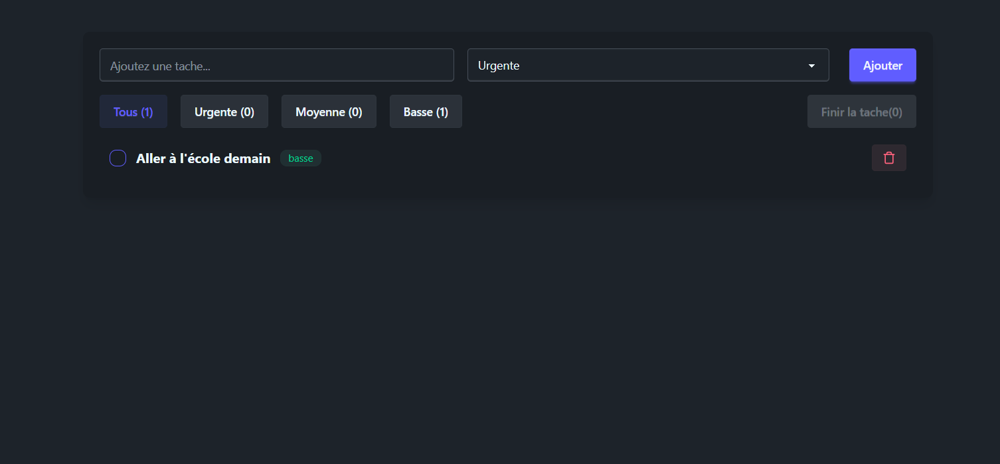

# 📝 To-Do List App (React)

Application de gestion de tâches simple, moderne et rapide, développée avec **React** et stockant les données dans le **localStorage** afin de conserver les tâches même après un rafraîchissement de la page.

---

## 🔥 Fonctionnalités

- ➕ Ajout d’une tâche avec un niveau de priorité : **Urgente**, **Moyenne**, **Basse**
- 🔍 Filtrage dynamique des tâches selon la priorité
- ✔️ Marquage d’une tâche comme terminée
- 🗑️ Suppression d’une tâche
- 💾 Persistance via `localStorage`
- 🎨 Interface moderne basée sur un thème sombre

---

## 🖥️ Aperçu de l’application




---

## 🧰 Technologies utilisées

| Outil / Lib | Description |
|-------------|-------------|
| React | Base de l'application |
| CSS / TailwindCSS | Design UI |
| localStorage | Stockage des données côté navigateur |

---

## 🚀 Installation & Lancement

    ```bash
    # 1. Cloner le projet
    git clone https://github.com/nicostar-lab/to-do-list.git

    # 2. Se déplacer dans le dossier
    cd to-do-list
    cd todolist

    # 3. Installer les dépendances
    npm install

##📁 Structure du projet (exemple)
src/
│── components/
│     ├── TodoInput.jsx
│     ├── TodoItem.jsx
│     └── Filters.jsx
│
│── App.jsx
│── index.js
│── styles.css

##🌍 Déploiement

L’application peut être déployée facilement sur :

Vercel

GitHub Pages

Aucun backend n’est requis.

##🏷️ Licence

Projet libre d’utilisation à but éducatif et personnel.

##⭐ Support

Si tu trouves ce projet utile, pense à laisser une ⭐ sur GitHub !

